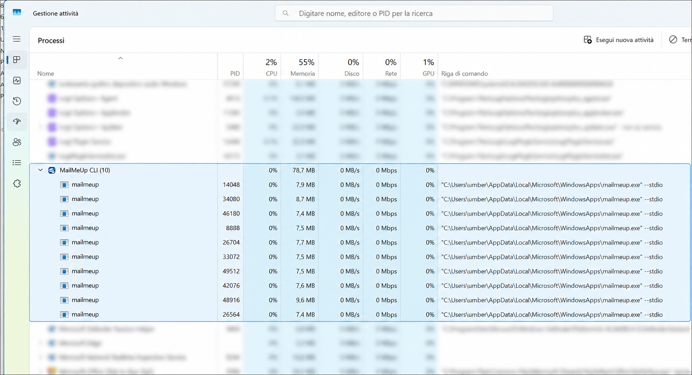
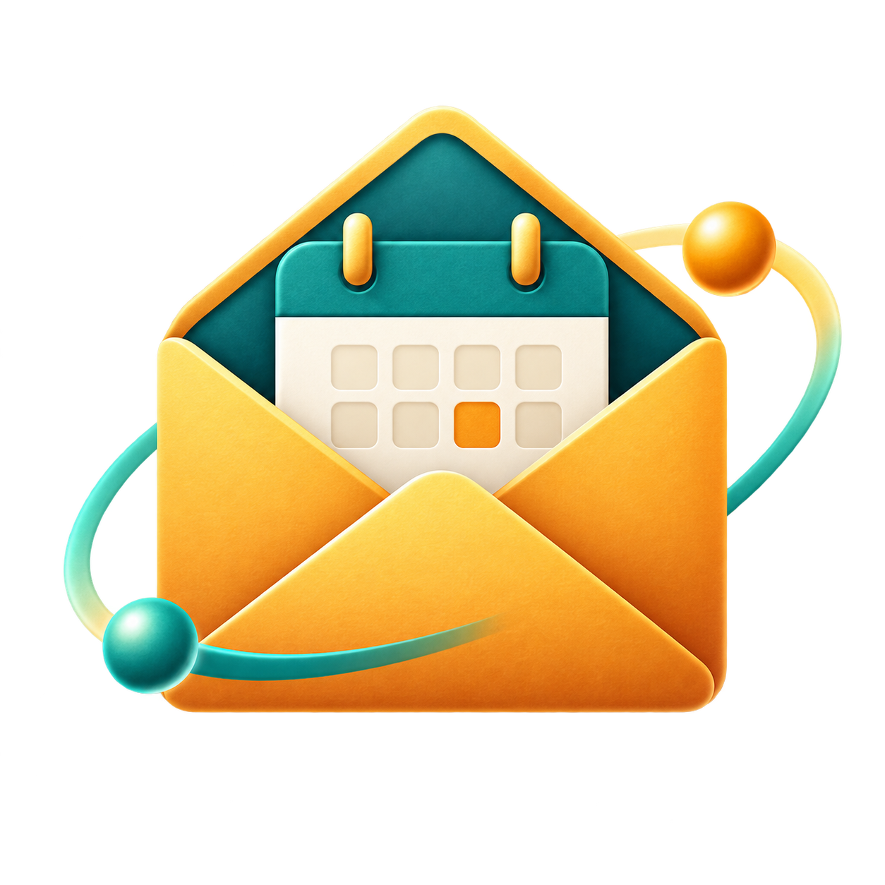

# MailMeUp — Connect your inboxes to your AI assistant.

Search Google and Microsoft email and calendars from Codex, Claude, or another app with local MCP support, including Visual Studio Code.

Connect your work, personal, and client accounts, then ask for messages or appointments across them. You choose which accounts the assistant can read. MailMeUp runs on your computer and can't send mail or change your accounts.

**[Get started](docs/GETTING_STARTED.md)** · [Windows portable setup](docs/WINDOWS_PORTABLE.md) · [Client compatibility](#ai-assistant-support) · [Privacy](docs/PRIVACY.md)

*Example search with addresses hidden. Setup and testing focus on Codex on Windows x64. Other clients haven't been tested with MailMeUp.*

## Get started

1. Extract the [Windows portable ZIP](docs/WINDOWS_PORTABLE.md) and open `MailMeUp.Desktop.exe`.
2. Follow [provider registration](docs/APP_REGISTRATION.md), sign in to each account, and choose what to share.
3. Connect to Codex, then ask for unread mail or upcoming meetings. See [the setup guide](docs/GETTING_STARTED.md) for the full steps.

> [!WARNING]
> **MailMeUp is still an early preview.** Try it while keeping an eye on the results. Commands, setup steps and local data formats may change before a stable release.

> **Your assistant may send the information you request to its AI service.** MailMeUp runs locally, but that doesn't make the whole conversation offline. See [privacy](docs/PRIVACY.md).

## Why MailMeUp?

Connect several independent mailboxes without switching accounts in your assistant. Sign in to each Google or Microsoft account separately and choose what to share. A mix of ten work and personal accounts is a useful example, but that account count hasn't been tested.

Ask for the latest message about a project, unread mail across your accounts, or next week's meetings. Start with a short list, then open the details you need.

The preview already supports multiple accounts. Easier onboarding remains work in progress, and setup currently focuses on Codex; see [before you start](#before-you-start) and [AI assistant support](#ai-assistant-support).

How this compares with built-in connectors (research: September 19, 2026)

The official documentation reviewed did not establish a built-in setup for connecting ten independent Google/Microsoft accounts in Codex or Claude. That is a documentation finding, not proof that every plugin is limited to one mailbox:

- Claude's [Google Workspace guide](https://support.claude.com/en/articles/10166901-use-google-workspace-connectors) describes access to the connected Google account, without documenting several simultaneous Gmail account connections.
- Claude's [Microsoft 365 guide](https://support.claude.com/en/articles/12542951-set-up-the-microsoft-365-connector) explicitly supports delegated access to shared mailboxes. Those mailboxes are accessed through an authorized work account; this is distinct from signing in to several independent accounts across providers.
- OpenAI documents [plugins](https://learn.chatgpt.com/docs/plugins) and [custom MCP connections](https://learn.chatgpt.com/docs/extend/mcp?surface=cli) for Codex. Those extension points allow other integrations; these guides do not establish a universal one-mailbox limit for Gmail or Outlook plugins.

MailMeUp's focus is a simple, local, read-only connection for the independent accounts you choose to share with your assistant.

## Small and native

The MailMeUp command-line processes in the Task Manager snapshot below use **7.4–9.6 MB of RAM each** while waiting for requests. That's one snapshot, so memory use will vary with the work you're doing.

I build small, native apps. MailMeUp's Windows setup app lets you connect accounts and choose what to share. Other platforms still need testing.

*MailMeUp is highlighted. Other processes are blurred for privacy.*

## What you can try

- Search across Gmail, Google Workspace, Outlook.com and Microsoft 365 inboxes.
- List unread messages or messages in a received-time range, with optional sender, recipient and attachment filters.
- Show appointments from Google Calendar and Microsoft calendars.
- Choose which accounts and calendars to include.
- Return short results first, then open the details you need.

Each person connects their own accounts. You don't need a hosted MailMeUp service or a public marketplace.

## Before you start

**Windows x64 is the current test platform.** The preview includes browser sign-in, multiple accounts, mail search and a combined calendar agenda. Searches skip Spam/Junk and Trash/Deleted Items by default.

> [!IMPORTANT]
> **There's still some setup to do.** For now, you need to register your own app with Google or Microsoft before connecting an account. Google gives you a configuration file; Microsoft gives you an Application (client) ID. The [registration guide](docs/APP_REGISTRATION.md) walks you through it. Making this easier is part of the work ahead.

> [!NOTE]
> **MSIX installers are temporarily unavailable.** I'm working on the code-signing certificate needed to distribute them. Until then, use the Windows portable ZIP.

The Windows app helps you connect accounts, choose what to share and set up Codex. Its **Check read access** button tries sample searches and reads for mail and calendars separately. It helps spot connection problems; it doesn't guarantee every future search will work.

Prefer no installer? The [complete Windows portable ZIP](docs/WINDOWS_PORTABLE.md) includes the setup app and CLI/MCP tools. Extract the whole ZIP and open `MailMeUp.Desktop.exe`. Keep that folder in place after connecting Codex.

Your sign-in tokens stay on your computer, protected by the operating system. Earlier builds have been tried with real Google and Microsoft accounts. Newer changes still need checks; the [validation record](docs/VALIDATION.md) lists what was tested in each version.

## AI assistant support

Codex is the main focus today. You can use the [Windows setup app](docs/WINDOWS_SETUP.md) to prepare its local plugin, or follow the [manual setup guide](docs/CODEX_SETUP.md).

MailMeUp connects through a local MCP process. Claude, Visual Studio Code, and other MCP clients are intended connection options, but haven't been tested with MailMeUp. ChatGPT Desktop isn't supported as a direct local connection yet.

If you'd like to help try another client and document the setup, see [how to contribute](CONTRIBUTING.md).

## Where it runs

- **Windows x64:** the preview has been built, signed and installed locally. Some command and UI checks passed on earlier versions; a clean-machine installation and the remaining setup and update checks are still needed.
- **Windows ARM64:** the package builds, but hasn't been run on ARM64 hardware.
- **macOS and Linux:** not tested or supported in this preview, including sign-in and secure token storage.

## How it fits together

Your accounts connect to your assistant through MailMeUp's local MCP process. Email and calendars use the same connection. Requested information may reach your assistant's AI service. See the [architecture guide](docs/ARCHITECTURE.md).

## Explore the project

- [Short product overview](docs/PRODUCT.md)
- [Getting started](docs/GETTING_STARTED.md)
- [Calendars and appointments](docs/CALENDARS.md)
- [Accounts and credentials](docs/AUTHENTICATION.md)
- [Register the app with Google and Microsoft](docs/APP_REGISTRATION.md)
- [Privacy](docs/PRIVACY.md)
- [Connect to Codex](docs/CODEX_SETUP.md)
- [Build and contribute](docs/DEVELOPMENT.md)

For developers: [how the code fits together](docs/ARCHITECTURE.md), [MCP tools](docs/MCP_CONTRACT.md), [release process](docs/RELEASING.md) and [test results](docs/VALIDATION.md).

[MIT license](LICENSE). [Contributions](CONTRIBUTING.md) and [security reports](SECURITY.md) are welcome. Independent project; no endorsement by OpenAI, Google or Microsoft.

Artwork, source prompts and writing style: [brand guide](docs/BRAND.md).

## More from MeUp

  

  <a href="https://github.com/umbertotechnopreneur/MailMeUp"><strong>MailMeUp</strong></a> · Connect your inboxes to your AI assistant. 
  <a href="https://github.com/umbertotechnopreneur/PromptMeUp"><strong>PromptMeUp</strong></a> · Describe your task. Get the command. 
  <a href="https://github.com/umbertotechnopreneur/TrackMeUp"><strong>TrackMeUp</strong></a> · Track your time. Find what you worked on.

Brand mark, not an app icon. <a href="docs/assets/meup/README.md">Visual style and image credits</a>.

Built by <a href="https://umbertogiacobbi.biz/">Umberto Giacobbi</a>, with help from contributors.

