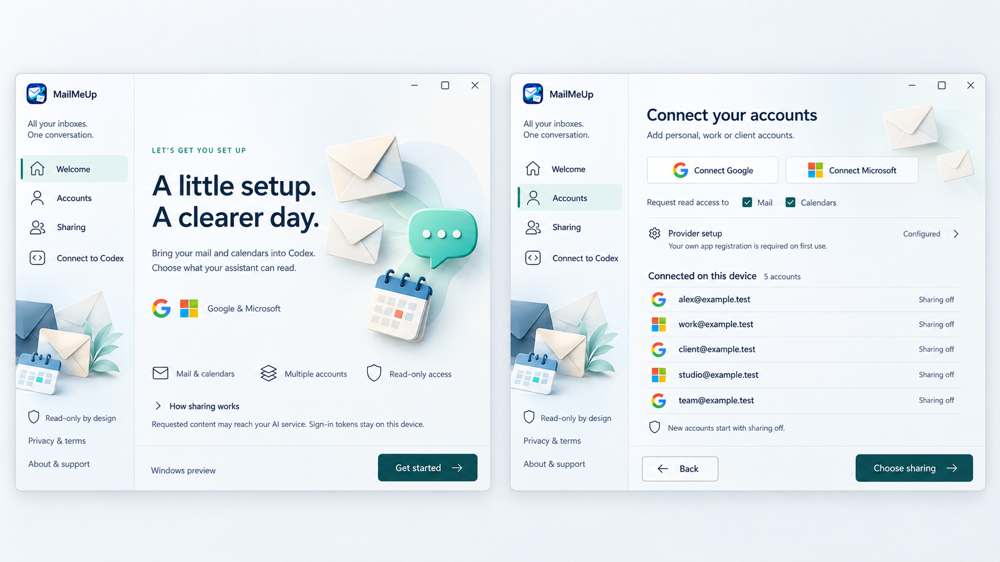
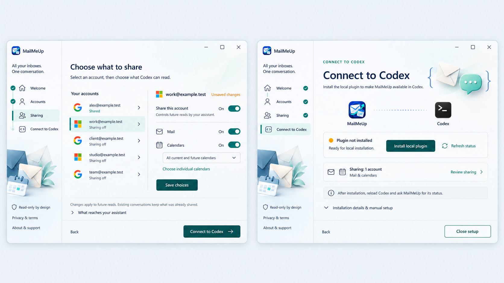

  

# MailMeUp

**All your inboxes. One conversation.**

Connect as many supported Google and Microsoft email accounts as you need to any compatible AI assistant through one local, read-only bridge. MailMeUp combines an MCP server, a CLI and a Windows desktop setup app. The first-class setup today focuses on OpenAI Codex; ChatGPT Desktop is not yet a direct local MailMeUp integration.

> [!WARNING]
> **MailMeUp is pre-alpha software.** It is intended for development and supervised testing. Commands, setup steps and stored local data may change before the first stable release.

> **Read-only by design for the current scope.** MailMeUp will help you find and read information. It will not send email, change messages, create or edit appointments, delete anything from your accounts, or send invitations.

## A clear four-screen setup flow

> [!NOTE]
> These product-flow concepts are based on the implemented Windows wizard. They show the intended experience, not pixel-perfect screenshots of the current UI.

## Why MailMeUp?

Built-in Gmail and Outlook integrations are useful when one connection is enough. The frustration begins when email is split across personal, company, client and project accounts. Multi-account availability varies by app, account, plan, workspace and client, so bringing every relevant inbox into the same request is not always a predictable experience.

MailMeUp is built for that reality. Connect as many supported Google and Microsoft accounts as you choose, decide which accounts participate and search them together from one conversation. It gives professionals, and anyone managing more than one address, a modern local bridge without creating another hosted inbox.

## What it will do

- Search across Gmail, Google Workspace, Outlook.com and Microsoft 365 inboxes.
- List unread messages or messages in a received-time range, with optional sender, recipient and attachment filters.
- Show appointments from Google Calendar and Microsoft calendars.
- Let you choose which accounts and calendars to include.
- Return short results first, then open the details you need.

MailMeUp runs on your computer. Each user connects their own accounts. No marketplace or hosted service is required.

## What works today

**The current pre-alpha build is usable for supervised testing on Windows x64. It is not a stable release.**

> [!IMPORTANT]
> **Provider setup is currently required.** To connect Google or Microsoft accounts, each user must currently register their own OAuth desktop application and configure its Client ID locally. Google also requires the downloaded desktop client configuration file; Microsoft requires its Application (client) ID. No provider credentials are bundled with MailMeUp. Follow the [provider setup and CLI guide](docs/APP_REGISTRATION.md). We are actively working on a simpler onboarding experience.

The current source includes local provider setup, interactive multi-account sign-in, a per-account read-access check in the Windows wizard, compact cross-account mail search and a combined calendar agenda. The check exercises actual searches and sample detail reads, reports Mail and Calendar independently and distinguishes missing samples from failures; it never returns their content. A passing sample is not a guarantee for every future search. Mail searches exclude Spam/Junk and Trash/Deleted Items by default. Client credentials and account token caches use operating-system protection. Earlier read-only flows were exercised with real Google and Microsoft accounts without including account content in validation output; see the [validation record](docs/VALIDATION.md) for version-specific evidence.

*Example conversation with redacted addresses. MailMeUp searches selected accounts without modifying messages.*

## AI assistant support

The Windows setup preview adds a centered WinUI 3 wizard for accounts, sharing choices and a local Codex plugin. The MSIX declares a stable command alias so updates do not require a new executable path. See [Windows setup and packaging](docs/WINDOWS_SETUP.md) for its current validation limits.

Development currently focuses on OpenAI's Codex. MailMeUp uses the standard Model Context Protocol (MCP) over stdio, so it may also work with other compatible clients, including Claude. Other-client compatibility has not been tested. ChatGPT custom MCP connections currently require a remote server, so ChatGPT Desktop is not yet a direct local client for MailMeUp.

Contributors interested in Claude are welcome to help with compatibility testing, setup documentation and any necessary integration work. See [how to contribute](CONTRIBUTING.md).

## Platform status

- **Windows x64:** current MVP target; the MSIX preview was built, signed and locally installed, with alias and About UI checks passed. Clean-machine installation and upgrade checks remain.
- **Windows ARM64:** package builds, but has not been executed on ARM64 hardware.
- **macOS and Linux:** not tested, including browser OAuth sign-in and protected token storage. Support is not claimed for the current MVP.

## How it fits together

*Concept artwork for the email workflow. Calendars are also in scope. Information requested by your assistant may be sent to its AI service; running locally does not mean all processing is offline.*

## Explore the project

- [Short product overview](docs/PRODUCT.md)
- [Roadmap](docs/ROADMAP.md)
- [Steps to a testable MVP](docs/MVP_PLAN.md)
- [Getting started](docs/GETTING_STARTED.md)
- [Calendars and appointments](docs/CALENDARS.md)
- [Accounts and credentials](docs/AUTHENTICATION.md)
- [Register the app with Google and Microsoft](docs/APP_REGISTRATION.md)
- [Privacy](docs/PRIVACY.md)
- [Connect to Codex](docs/CODEX_SETUP.md)
- [Build and contribute](docs/DEVELOPMENT.md)

For developers: [architecture](docs/ARCHITECTURE.md), [MCP tools](docs/MCP_CONTRACT.md), [release process](docs/RELEASING.md) and [validation results](docs/VALIDATION.md).

Created by [Umberto Giacobbi](https://github.com/umbertotechnopreneur). [MIT license](LICENSE). [Contributions](CONTRIBUTING.md) and [security reports](SECURITY.md) are welcome. Independent project; no endorsement by OpenAI, Google or Microsoft.

Brand assets and generation prompts: [brand guide](docs/BRAND.md).
